# KRAFT4
## Итоговый проект четвёртого модуля

# Задание 1. Балансировка партиций и диагностика кластера

# Подготовка данных
1. Выполните команду:
```bash
docker compose up -d
```
2. Для просмотра запущенных контейнеров в Docker выполните команду:
```bash
docker ps
```
Эта команда отобразит список всех активных контейнеров, включая их идентификаторы, имена, статус, порты и другие важные параметры.
Ожидаемый результат команды:
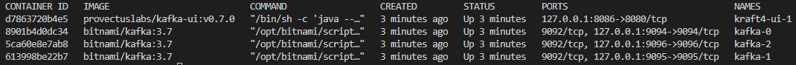

# Решение
1. Создайте новый топик balanced_topic с 8 партициями и фактором репликации 3.
Необходимо перейти в терминал контейнера kafka-0 при помощи команды:
```bash
docker exec -it kafka-0 bash
```
В терминале контейнера выполнить команду:
```bash
kafka-topics.sh --bootstrap-server localhost:9092 --topic balanced_topic --create --partitions 8 --replication-factor 3
```
Результатом выполнения команды будет следующее предупреждение и создание топика balanced_topic с заданными параметрами:
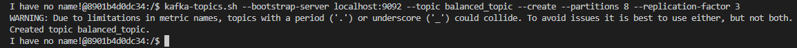

2. Определите текущее распределение партиций.
В терминале контейнера выполнить команду:
```bash
kafka-topics.sh --bootstrap-server localhost:9092 --describe --topic balanced_topic
```
Результатом выполнения команды будет детальная информация о топике balanced_topic, включая его настройки, количество партиций, репликацию и другие параметры:
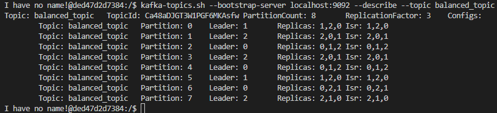

3. Создайте JSON-файл reassignment.json для перераспределения партиций.
В терминале контейнера выполнить команду (перейдите в директорию /tmp):
```bash
cd /tmp
```
Можно проверить директорию в которой находимся (так же это видно в терминале):
```bash
pwd
```
Результат команды:
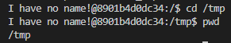

В терминале контейнера выполнить команду:
```bash
echo '{
    "version": 1,
    "partitions": [
      {"topic": "balanced_topic", "partition": 0, "replicas": [0, 1, 2], "log_dirs": ["any", "any", "any"]},
      {"topic": "balanced_topic", "partition": 1, "replicas": [1, 2, 0], "log_dirs": ["any", "any", "any"]},
      {"topic": "balanced_topic", "partition": 2, "replicas": [2, 0, 1], "log_dirs": ["any", "any", "any"]},
      {"topic": "balanced_topic", "partition": 3, "replicas": [0, 1, 2], "log_dirs": ["any", "any", "any"]},
      {"topic": "balanced_topic", "partition": 4, "replicas": [1, 2, 0], "log_dirs": ["any", "any", "any"]},
      {"topic": "balanced_topic", "partition": 5, "replicas": [2, 0, 1], "log_dirs": ["any", "any", "any"]},
      {"topic": "balanced_topic", "partition": 6, "replicas": [0, 1, 2], "log_dirs": ["any", "any", "any"]},
      {"topic": "balanced_topic", "partition": 7, "replicas": [1, 2, 0], "log_dirs": ["any", "any", "any"]}
    ]
}' > reassignment.json
```
Результат команды:
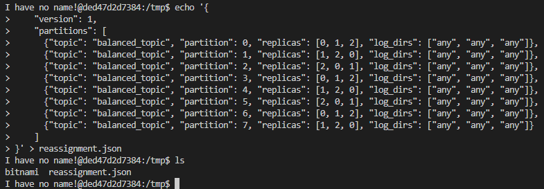

4. Перераспределите партиции.
В терминале контейнера выполнить команду:
```bash
kafka-reassign-partitions.sh \
--bootstrap-server localhost:9092 \
--broker-list "1,2,3" \
--topics-to-move-json-file "/tmp/reassignment.json" \
--generate
```
Результат команды:
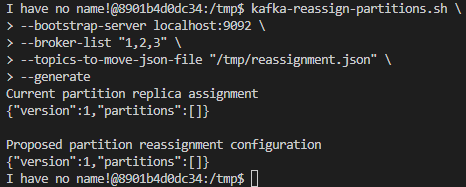

В терминале контейнера выполнить команду:
```bash
kafka-reassign-partitions.sh --bootstrap-server localhost:9092 --reassignment-json-file /tmp/reassignment.json --execute
```
Результат команды:
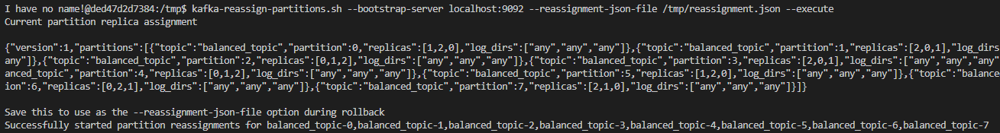

5. Проверьте статус перераспределения.
Проверим в следующем пункте.

6. Убедитесь, что конфигурация изменилась.
В терминале контейнера выполнить команду:
```bash
kafka-topics.sh --bootstrap-server localhost:9092 --describe --topic balanced_topic
```
Результат команды (видим что все соответствует требуемой конфигурации):
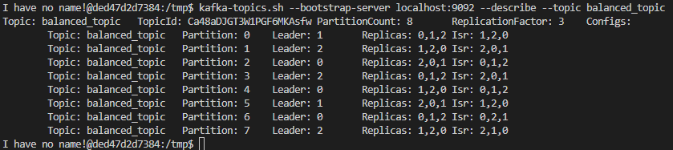

7. Смоделируйте сбой брокера:
7.1. Остановите брокер kafka-1.
В новом терминале выполнить команду:
```bash
docker stop kafka-1
```
Результат команды:
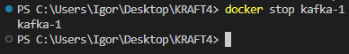


7.2. Проверьте состояние топиков после сбоя.
В терминале контейнера выполнить команду:
```bash
kafka-topics.sh --bootstrap-server localhost:9092 --describe --topic balanced_topic
```
Результат команды:
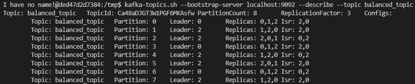

7.3. Запустите брокер заново.
В новом терминале выполнить команду:
```bash
docker start kafka-1
```
Результат команды:
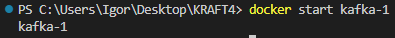

7.4. Проверьте, восстановилась ли синхронизация реплик.
В терминале контейнера выполнить команду:
```bash
kafka-topics.sh --bootstrap-server localhost:9092 --describe --topic balanced_topic
```
Результат команды:
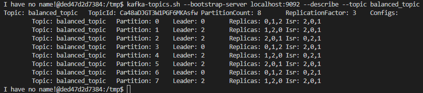

Вывод: после моделирования сбоя и восстановления брокера видим что была восстановлена синхронизация реплик, но упавший брокер был исключен из лидерства.

# Задание 2. Настройка защищённого соединения и управление доступом

# Подготовка данных
1. Выполните команду:
```bash
docker compose -f docker-compose-zoo.yml up -d
```
2. Для просмотра запущенных контейнеров в Docker выполните команду:
```bash
docker ps
```
Эта команда отобразит список всех активных контейнеров, включая их идентификаторы, имена, статус, порты и другие важные параметры.

# Решение
Создать два топика и настроить права доступа:
- topic-1 (доступен как для продюсеров, так и для консьюмеров)
- topic-2 (продюсеры могут отправлять сообщения, консьюмеры не имеют доступа к чтению данных)

1. Подключиться к брокеру и создать топики:
```bash
# команда для создания топика topic-1
kafka-topics.sh --create --topic topic-1 --bootstrap-server localhost:9092 --partitions 3 --replication-factor 2
# команда для создания топика topic-2
kafka-topics.sh --create --topic topic-2 --bootstrap-server localhost:9092 --partitions 3 --replication-factor 2
```

2. Запустим продюсер

3. Запустим консьюмер